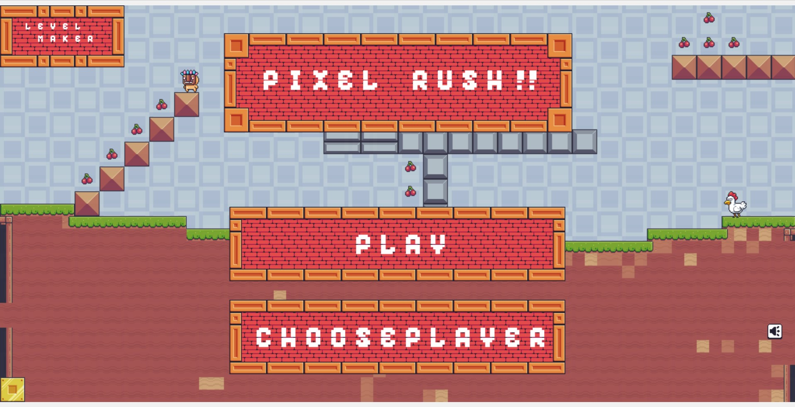

# Pixel Rush

**Pixel Rush** is a platformer game where you pass various levels and have fun. We have three characters **Virtual Guy**, **Mask Man** and **Pink Man**. Also, we can have fun making our own custom levels in the level editor.

### Usage

Press arrow keys or 'A', 'S', 'D' and 'F' to move around and space to jump. The goal of the game is to pass levels. A level is completed when you have eaten all the fruits. For now the game has 2 levels where there are various traps and enemies. Have fun playing!! 😁😁

### Setting up Locally

Just download the project and run index.html or run the live server if you have installed it and enjoy the game.

### Screenshot

